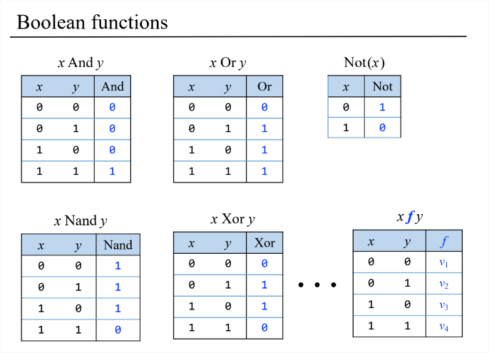
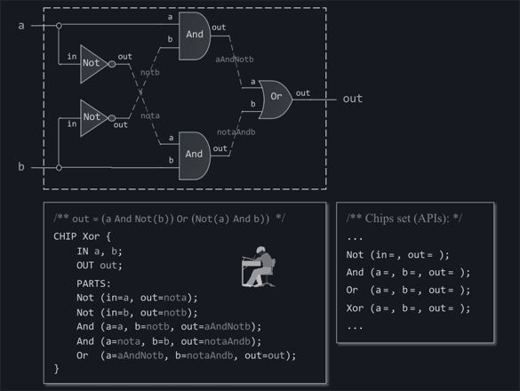
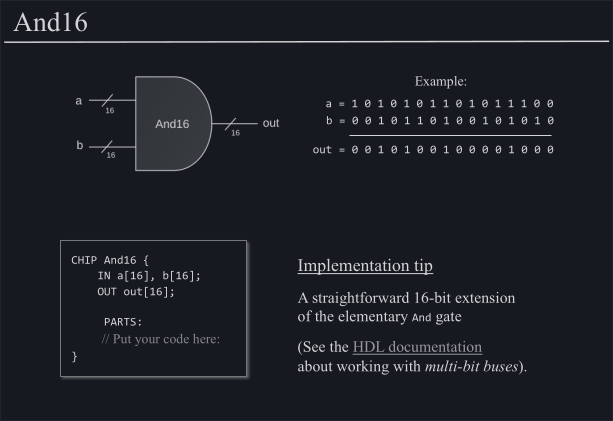
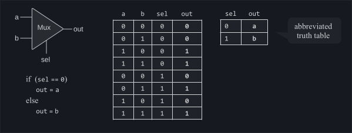

# Table of Contents

1.  [From Truth Tables to Logic Gates](#org0c1bed2)
2.  [From Logic Gates to Hardware Description Language](#org6b5d49c)
3.  [Concatenating Gates](#org6b59e0c)
4.  [We can also have other combinations of numbers of inputs and outputs (MUX and DMUX)](#org1060f40)

# From Truth Tables to Logic Gates

**Logic Gates** are physical realisations of **Truth Tables**, the one that we know from school (a truth table can also be called a **Boolean function**, if you want to sound fancy).

Here are the basic ones:

We only assume that we have a Nand Gate given and we are building all of the other ones based on this one. And as we are adding Gate after Gate, we are able to reuse them to build other Gates further along the line.

# From Logic Gates to Hardware Description Language

Since it is a bit too much of work to really build those **Logic Gates** physically with electrical circuits, we use a simulator. And the simulator takes as input our **Logic Gate** but written in a certain way: **Hardware Description Language (HDL)**

# Concatenating Gates

We can also assume that we have more than one Gate at a time. This way we arrive at the notion that we can have a whole array of a given size as input. E.g.: **16** (as in **16bit processor**)

# We can also have other combinations of numbers of inputs and outputs (MUX and DMUX)

