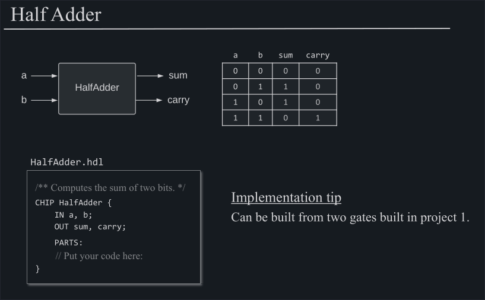
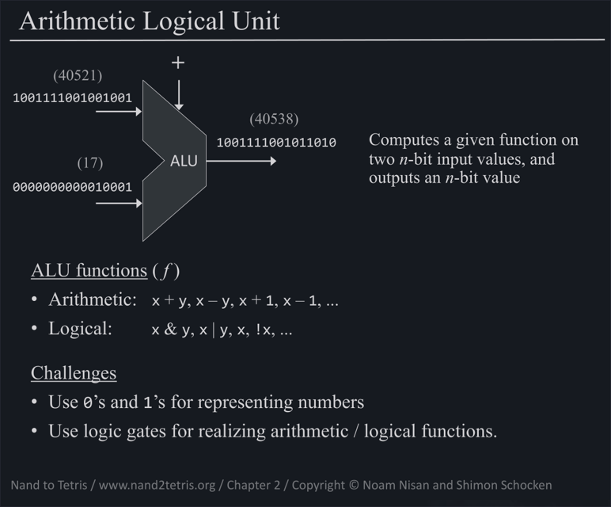

# Table of Contents

1.  [Adding Chips](#org2c6f173)
2.  [ALU](#org1f74c27)

# Adding Chips

Since we now have some Gates to work with, we can try to add Chips that solve more complex problems

So we are continuing building Chips, but Chips that serve as mathematical functions, such as &ldquo;+&rdquo;.

# ALU

Putting all of this together we arrive at our ALU, a Chip that is capable of calculating a multitude of functions. It takes as input two **16bit** numbers and has a **16bit** number as output (plus two Flags, one that is telling if the output was 0 (`zr`) and one that is telling if the output was negative (`ng`))

