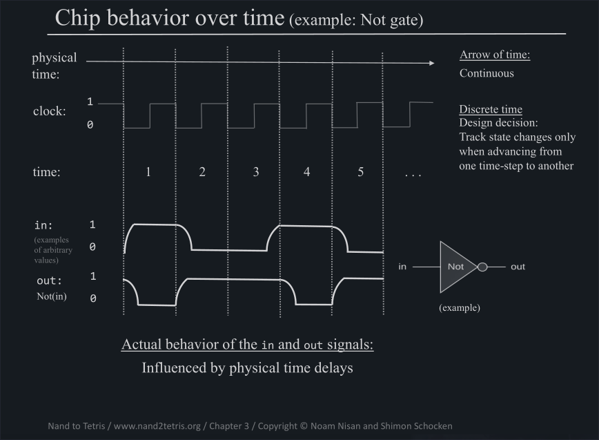

# Table of Contents

1.  [Memory](#org0a65c99)
    1.  [Sequential Logic](#orgae69639)
        1.  [Time steps](#orge994586)
        2.  [Technical implementation](#orgef46359)
        3.  [Latch / Data Flip Flop](#org6602bd7)

# Memory

## Sequential Logic

Up until this point we were concerned with Logic Gates and Chips that are time independent, meaning that they are only dependent on the current inputs. This is called **Combination Logic**.

We now like to introduce **Sequential Logic** where the output depends on the previous inputs as well.

### Time steps

Time will be represented as a discrete sequence of time ($$t = 0, 1, 2, 3, 4 ...$$).

### Technical implementation

To build a clock, that is giving us discrete time units, we are going to use an oscillator, which is oscillating between on and off at a given rate ($$ freq=[H] $$).

In Each time unit, any input or output value of a gate is continious.

1.  Physical problems

    The change in current and voltage is continuous as well. Therefore there will be delays in the signal of the oscillator and the signal will rather look like the following.
    
    
    
    These delays need to be taken into account and a common design decision is to track state at the end of a cycle.
    
    
    
    The resulting effect is that our sequential logic gates are only reacting to a given input at each end of cycle, whereas combinational gates are going to &ldquo;react&rdquo; immediately.

### Latch / Data Flip Flop

The most elemetary sequential gate that we can imagine is called a *Latch* or *Data Flip Flop*. The *Latch* outputs the input of the previous Time step.

