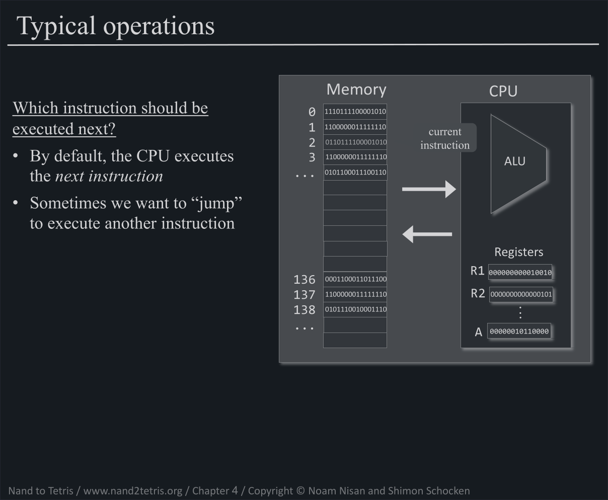
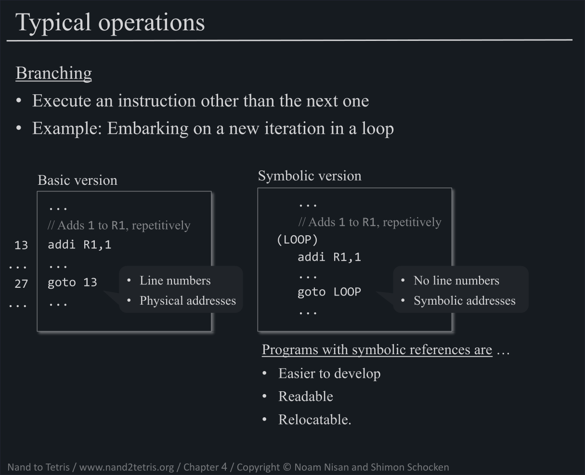
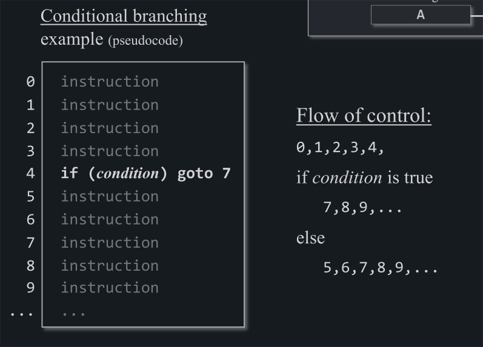
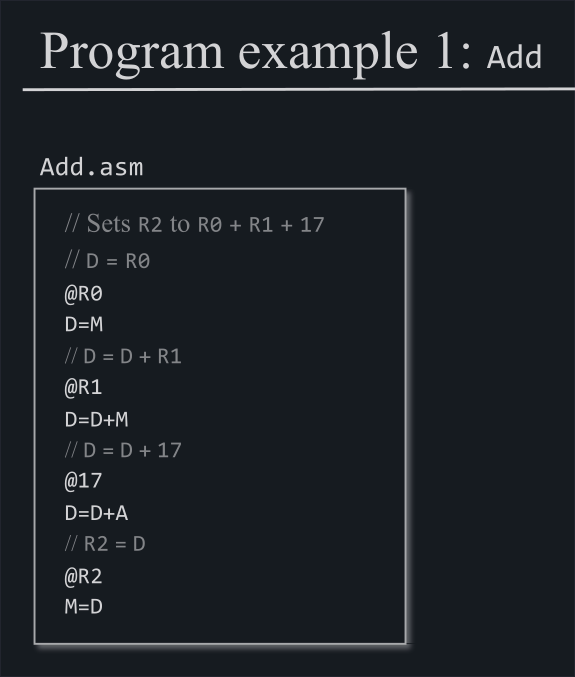
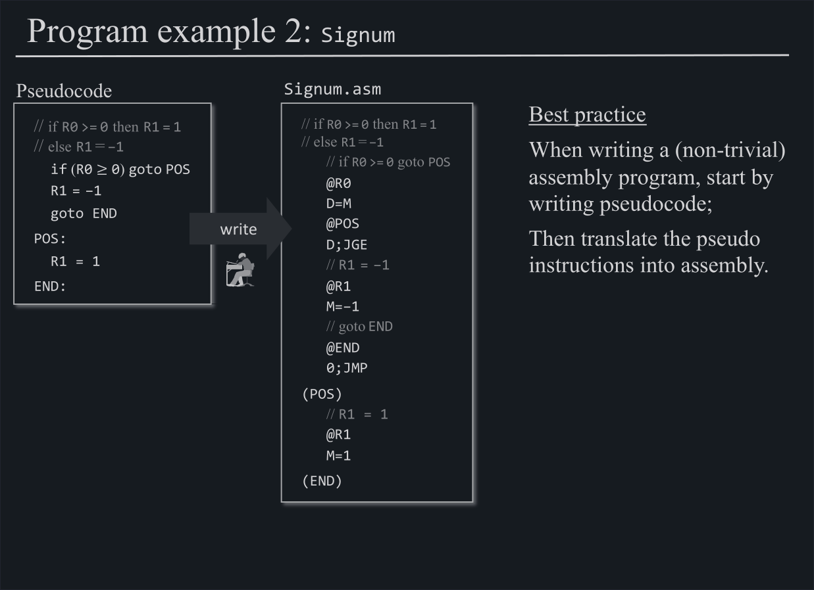

# Table of Contents

1.  [Register](#org563f26f)
2.  [Hack Machine Language](#orgf1464ad)
    1.  [What we are doing](#org6ff4e5e)
    2.  [What is Machine Language](#orgbb3e785)
    3.  [Instruction set of the Hack Machine Language](#org1f00e47)
        1.  [A-Instruction (and A-register)](#orgd7f42d0)
        2.  [C-Instruction](#org6804cc3)
    4.  [Writing Hack Machine Language code](#org1065889)
        1.  [Example 1 - Add](#org12684f5)
        2.  [Example 2 - Signum](#org56d3ec3)
    5.  [The Hack Machine Language Specification](#orgba92c8e)
3.  [The project](#org75b16ae)
    1.  [Testing](#org84b0865)

# Register

We now have our **ALU**, which means that we can compute certain functions, and we have our **Memory**, which means that we can save state over time (in registers).

We want to bring these two together, meaning that we want to compute functions with input values obtained from memory values and then save the output values back into **Memory**.

1.  **Data registers**: The first remark that we can make is, that the input values to our functions need to come from somewhere and since we only have registers, there needs to be registers that hold these *data values*.

2.  **Address register**: Secondly, to store and obtain a value from somewhere, the somewhere needs to be a value in itself as well, therefore we will have registers, that hold the address of other registers.

3.  **Instruction register**: Moreover, the thing that we want to do, the instruction (a combination of computing a function with certain input value and storing its output values somewhere), needs to be some value as well. And you guessed it, it needs to be stored in a register as well.

**Conclusion**: Since we only have **16bit register**, data values as well as address values and instruction values need to be represented as a 16bit binary number.

# Hack Machine Language

## What we are doing

So we want to be able to say things like the following:

-   Add what is in Register 2 to what is in Register 1 (R1 <- R1 + R2)
-   Add the value 73 to what is in Register 3 (R3 <- R3 + 73)
-   Put what is in Memory 137 into Register 4 (R4 <- Memory[137])
    -   usually there are only a few registers, that really have names like (R1, R2, R5 and so on)
-   If the value stored in Register 1, goto to Register 15 and execute the instructions from there
    -   this is a little bit more difficult to understand, but what one needs to get, is that the execution of a program is the execution of a chain of instructions in a certain order, and these instructions need to be stored somewhere in a specific order
    -   so imagine our registers as a list of instructions, where the instructions are executed in order, and if we want to jump to another instruction, we would need to indicate the address, where this instruction is stored, and the following instruction after that will be the one that comes next.
        
        
    
    -   in the files where we will put our **Machine Language Code**, the next instruction will either be the one on the next line inside the file or the instruction on  specific **line number** (**goto**), where we want to jump (this is called **Branching**)
        -   those line numbers are going to be translated to symbolic addresses by the assembler (more on that in the project on the assembler)
            
            

## What is Machine Language

All of this boils down to the **Manipulation of Registers**. The way that this is done, and the way that it is formalised, is part of the work of someone who is conceptualising a computer.

And the **Machine Language** is the resulting **formalism** that describes which ways of **Manipulating Register** exist and through which we can communicate what should be done.

One line written in **Machine Language** corresponds to one **instruction** that will be executed by the machine. Therefore one line is going to be translated to exactly one **16bit binary number**.

## Instruction set of the Hack Machine Language

A **Machine language** therefore needs to correspond to the set of instructions that the computer is capable of executing.

This **instruction set** was conceptualised and conceived by the course authors, and luckily, it only consists of **2 kinds of instructions**.

### A-Instruction (and A-register)

A-Instructions are Address instructions, meaning that they are *selecting* certain registers.
The **A-register** will be a dedicated register in our Computer architecture that will hold an address.
Whatever address this **A-register** hold, is the address of the register, which value the Memory will be emitting at that moment.

`@19`

1.  The value that is stored in the **A-register** will be 19
2.  The value that is emitted by the Memory will be the value of the register with address 19
3.  The register with address 19 becomes available to be manipulated (**pointer-based processing**)

In our **Machine Language** the register that comes *available* for us to be manipulated is denoted by the letter **M** in our **Machine Language**.

### C-Instruction

**C-instructions** are **Compute-instructions**. They are more vast but conceptionally easier to understand, once one has understood the **A-register** and **M-register**.

We only need to add one more special register: the **D-Register**.
This is a simple **Data register** that is suppose to hold a temporary value.

With this in hand, one can share the concrete specification.

Until now, I didn&rsquo;t make any difference between RAM and ROM. In practice, there will be no big difference, other than that the ROM will hold the instructions and shall not be written to.

1.  Branching

    **Conditional Branching**: The `dest = comp; jump` syntax allows to jump to different intructions inside the code.
    
    
    
    **Unconditional Branching**: A `goto LABEL` command can be expressed as a C-instruction: `1; LABEL`
    
    

## Writing Hack Machine Language code

To be able to write more readable and writable code, the Hack Machine language provides two additional features: Labels and Variables.

Variables are basically used in the same manner as variables in other programming languages.

Labels are there to reference certain lines in the code. They are used with branching instructions (`dest = comp; jump`, `Goto`)

### Example 1 - Add

### Example 2 - Signum

## The Hack Machine Language Specification

This is the full Hack Machine Language Specification, from which we can also infer which **16bit binary** each instruction is to be translated to.

# The project

The project consists of writing &ldquo;simple&rdquo; programs in **Hack Machine language** as seen in the examples ([Example 1 - Add](#org12684f5) & [Example 2 - Signum](#org56d3ec3))

`add, fill, flip, for_loop_with_pointer, keyboard, mult, screen, signum, sum1Ton`

## Testing

To test the code written, one loads the written Code into the provided CPU-emulator and checks with provided test scripts or simply looks if the code does what it is supposed to do.

