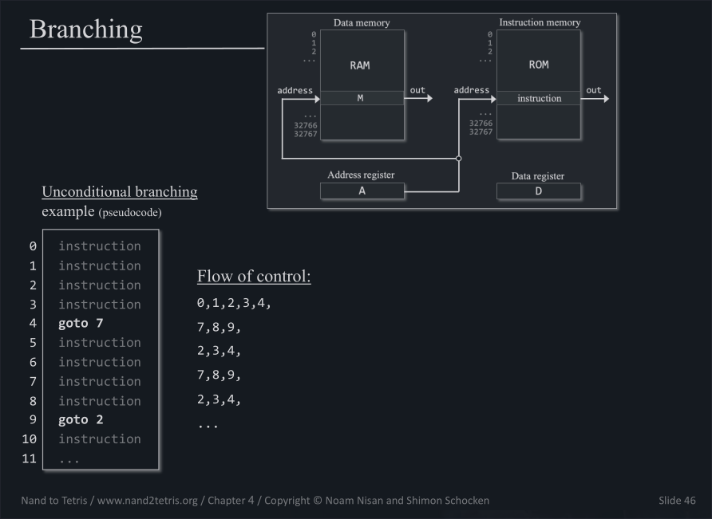

# Table of Contents <span class="tag" tag-name="TOC"><span class="smallcaps">TOC</span></span>

- [Content of Registers](#content-of-registers)
- [Hack Machine Language](#hack-machine-language)
  - [What we are doing](#what-we-are-doing)
  - [What is Machine Language](#what-is-machine-language)
  - [Instruction set of the Hack Machine
    Language](#instruction-set-of-the-hack-machine-language)
  - [Control Flow - Branching](#control-flow---branching)
  - [Writing Hack Machine Language
    code](#writing-hack-machine-language-code)
  - [The Hack Machine Language
    Specification](#the-hack-machine-language-specification)
- [The project](#the-project)

# Content of Registers

Now that we have our *ALU* for computing functions and our *Memory* for
storing state over time, we aim to integrate these two components. This
entails computing functions using input values from memory and storing
the results back into *Memory*.

1.  **Data registers**: Input values for our functions must come from
    registers. Therefore, we need specific registers to hold these data
    values.

2.  **Address register**: To access and store values from memory, the
    locations must be represented as values too. Thus, we introduce
    registers to hold the addresses of other registers.

3.  **Instruction register**: The desired operation, or the instruction,
    which involves computing a function with specific inputs and storing
    the outputs, also needs a dedicated register for storage.

*In conclusion*: Since we are limited to using *16-bit registers*, both
data values and the address and instruction values must be represented
as 16-bit binary numbers.

# Hack Machine Language

## What we are doing

So we want to be able to say things like the following:

- Add what is in Register 2 to what is in Register 1 (R1 \<- R1 + R2)
- Add the value 73 to what is in Register 3 (R3 \<- R3 + 73)
- Put what is in Memory 137 into Register 4 (R4 \<- Memory\[137\])
  - usually there are only a few registers, that really have names like
    (R1, R2, R5 and so on)
- If the value stored in Register 1, goto to instruction 15 and execute
  the instructions from there


## What is Machine Language

All these operations ultimately involve the manipulation of registers.
This process and its formalization are key aspects of computer
conceptualization.

The resulting formalism, known as **Machine Language**, outlines the
methods of register manipulation available and serves as a means to
communicate tasks to be performed.

In **Machine Language**, (almost) each line corresponds to an
instruction executed by the machine and is translated into a 16-bit
binary number.


## Instruction set of the Hack Machine Language

A *Machine language* must align with the instructions that the computer
can execute (the **instruction set**). This set of instructions was
developed by the course creators and includes only *2 types of
instructions*.

### A-Instruction

A-instructions are <u>address</u> instructions, indicating that they
target specific registers.

The *A-register* in our computer architecture will serve as a dedicated
register to store an address.

The value held in this *A-register* corresponds to the address of the
register from which Memory will emit a value at that point.

`@19`

1.  The value that is stored in the **A-register** will be 19
2.  The value that is emitted by the Memory will be the value of the
    register with address 19
3.  The register with address 19 becomes available to be manipulated
    (**pointer-based processing**)

In **Hack Machine Language** the register that comes *available* for us
to be manipulated is denoted by the letter **M** in our **Machine
Language**.


(Note: When using the jump directive described in
[C-Instruction](#C-Instruction) and [Control Flow -
Branching](#control-flow---branching), the address stored in the
A-register denotes the address in the [Instruction
memory](#instruction-memory).)

### C-Instruction

"C-instructions" are shortened for "Compute-instructions," allowing for
a more comprehensive yet conceptually simpler understanding once the
A-register and M-register are grasped.

By introducing just one more unique register, the D-Register, a basic
Data register used for temporary value storage, we complete the
essential components.

Having these elements in place, the specific layout can be easily
outlined.


The `dest = comp; jump` syntax allows to jump to different intructions
inside the code. If `comp` equals `0`, the next instruction will be the
one stored in **ROM\[A\]** (**instruction memory**). More on that in
[Control Flow - Branching](#control-flow---branching).

## Control Flow - Branching

### Instruction memory

A program written in *Hack Machine Language* consists of a sequence of
instructions that are stored in the **instruction memory** that is
Read-Only-Memory (**ROM**).

Each address in the ROM corresponds to the position of an instruction
within the program.


The `dest = comp; jump` syntax allows to jump to different intructions
inside the code.

### Unconditional Branching

Unconditional Branching occurs if we want to jump to a certain
instruction inside the flow of a program, no matter what.



Using our [A-Instruction and Register](#A-Instruction) and
[C-Instruction](#C-Instruction), this can be achieved by e.g.:

``` asm
@6
0;JMP
```

As you can see, the value inside the **A-register** is now used as the
address of the next instruction.

But how do we know which one is the right address?

As you can see from the picture in [Instruction memory
picture](#instruction-memory), instructions are stored in ROM by their
position in which they appear in the Code, e.g.:

``` asm
;; some_code.asm
0   @0
1   D=M

2   @1
3   D=D+M

4   @2
5   M=D

6   @2
7   0;JMP
```

Here instruction with address \#8 (`0;JMP`, stored in ROM\[7\]) will
jump to instruction at address \#3 (`@1`, stored in ROM\[2\]) because
the **A-Register** was set to $2$ by instruction \#7 (`@2`).

### Conditional Branching

Conditional Branching occurs if we want to jump to a certain instruction
inside the flow of a program if a certain condition is met.


Concretely this can be achieved by using what is stored either in **D or
M-register** and possible modifications of the values that they store.


## Writing Hack Machine Language code

To be able to write more readable and writable code, the Hack Machine
language provides two additional features: Labels and Variables.

These two features are not part of the Hack Computer's specification.
They are features of the Assembler, which translates Hack Machine
language code into Hack Computer instructions. Each Assembler must
implement these features.

### Variables

Each time that we use an A-instruction, we can write a variable name
instead of a number. (`@var`).

Using (`@var`) instead of (`@100`) is more meaningful as it attaches a
name to the address, allowing us to understand its purpose from the
name.


There are also pre-defined variables.


### Labels

Labels are used to refer to specific points in a program's flow.

By placing labels on certain lines, we can then refer to the
instructions following the label.

This allows us to use labels in branching commands.


## The Hack Machine Language Specification

This is the full Hack Machine Language Specification, from which we can
also infer which **16bit binary** each instruction is to be translated
to.


# The project

The project consists of writing "simple" programs in **Hack Machine
language**.

To test the code, we load it into the CPU emulator and check using
provided test scripts or verify if it functions as intended.

`add, fill, flip, for_loop_with_pointer, keyboard, mult, screen, signum, sum1Ton`
