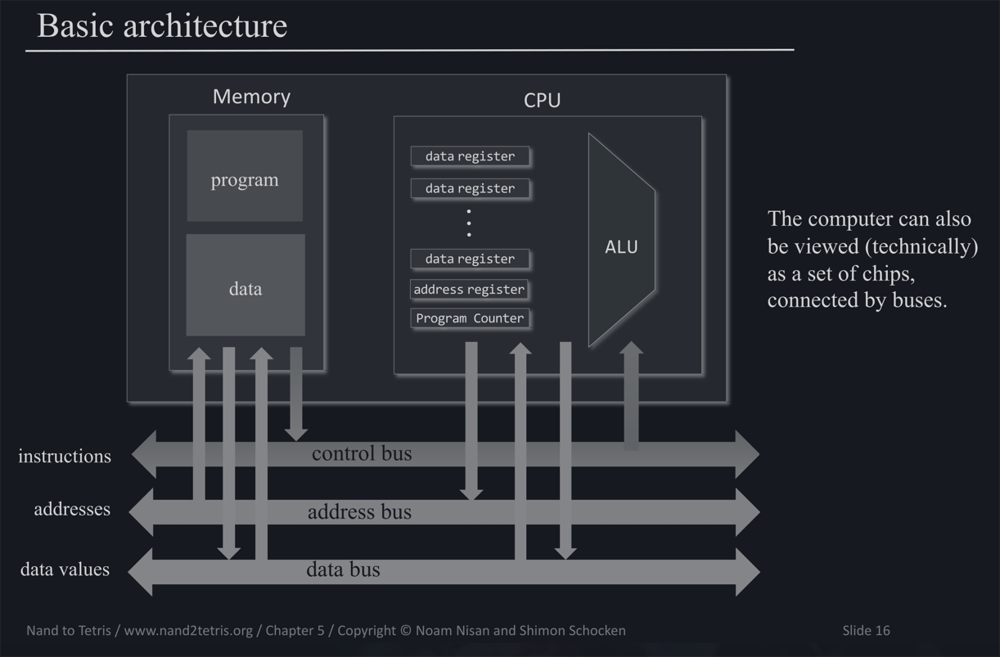
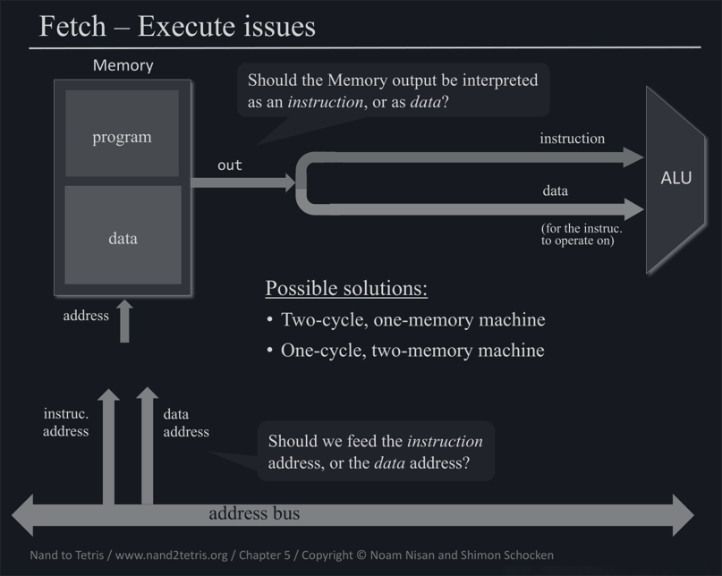
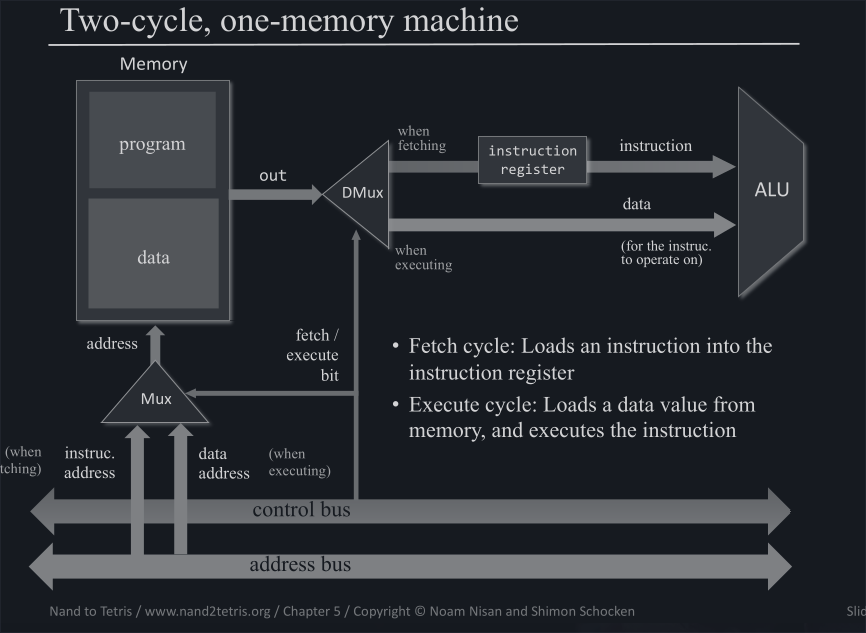
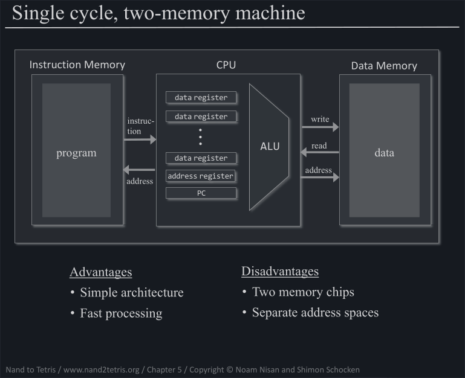
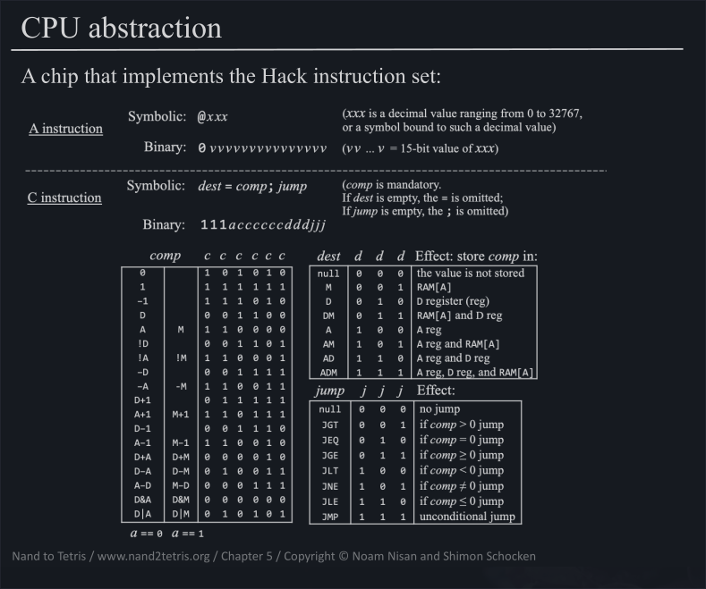
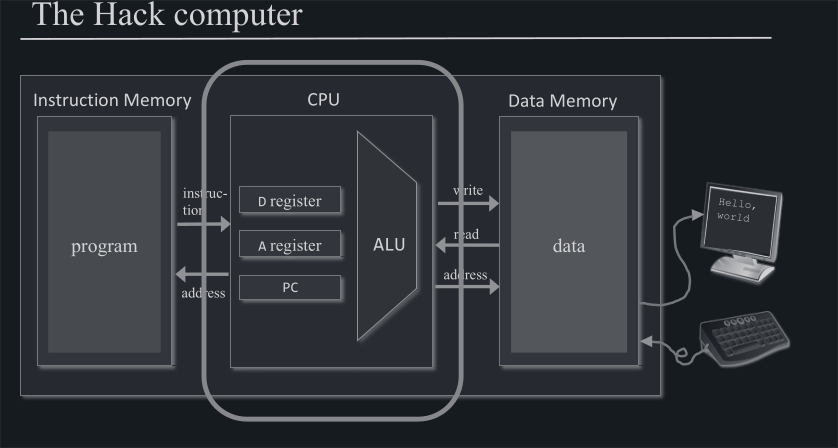
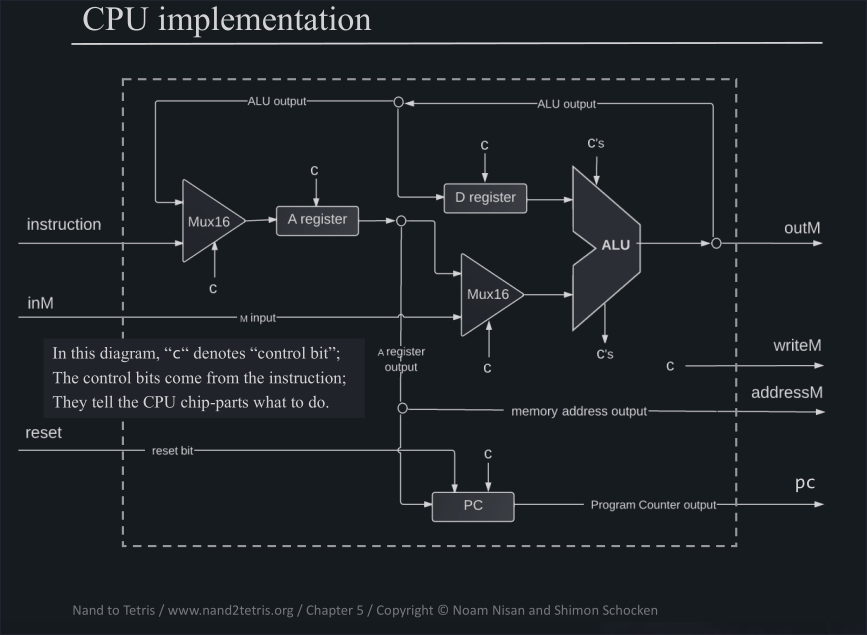

# Table of Contents

1.  [Basic Architecture](#org0249284)
2.  [Fetch-Execute Cycle](#org3ffbab6)
    1.  [Two-cycle solution](#org60f087a)
    2.  [Single-cycle solution](#orga2baca6)
    3.  [Hack Solution](#org6601197)
3.  [Project - Build the computer](#orgc693bd6)
    1.  [CPU and memory](#orge9b4db8)
    2.  [The CPU in detail](#org6ad1642)
    3.  [The project](#orgb0111e7)
        1.  [The Memory](#org56befec)
        2.  [CPU](#org6fe3acf)

We have all the building blocks of a Computer. We have registers that we need to construct a memory from and we have an ALU, that combined with dedicated registers and a Program Counter, will form our CPU.

# Basic Architecture

The computer can be viewed as a set of chips that is connected by buses (conceptionally).

**Data Bus**:

-   Holds the data that an instruction is to be executed on
-   emited by data-memory
-   read by ALU

**Control Bus**:

-   Holds the next instruction to be executed
-   emited by program-memory
-   read by ALU

**Address Bus**:

-   Holds
    -   either the address of the next instruction to be executed
    -   or the address of the data, that a instruction should be executed on
-   emitted by address register or program counter
-   read by memory

**Problem**:

How does one know what the address bus is currently holding?

The address of an instruction or the address of some data?

# Fetch-Execute Cycle

## Two-cycle solution

To solve this problem, one can imagine a simple Loop, where the address present in the address bus is interpreted either as an instruction to be retrieved **fetch** or the address of a data point, that a instruction is executed upon.

## Single-cycle solution

Another solution would be to have 2 seperate physical memories, where both memories are accessed simultanieously, in the same cycle

## Hack Solution

The Hack Computer Architecture has a unique design but basically is following the [Single-cycle solution](#orga2baca6).

The Hack Computer though is only interpreting instructions, but due to the design of the instruction the Computer can decide if it is either an instruction that computes something (C-instruction), or it is acutally the instruction to feed some data (A-Instruction).

# Project - Build the computer

This is how the computer looks like

## CPU and memory

## The CPU in detail

## The project

The goal of the project is to implement this Architecture with the Chips that we have already built.

We have a clear seperation of concerns. We need to build the RAM, the ROM and the CPU.

The ROM is actually provided by the NandToTetrisTeam as a built-in Chip, since it is really nothing else than the ROM with a limitation, and the team equipped the built-in chip with the ability to load a program in the hardware simulator.

### The Memory

We need to put together a big RAM Chip, the Screen Chip and the Keyboard Chip

### CPU

We need to figure out the way to combine all the Chips that we have built so far, paying attention to the different control bits as denoted in the [diagram](#org6ad1642).

